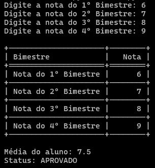

=== SISTEMA DE BOLETIM DE ALUNO - BÁSICO === 

Foram usados 3 arquivos:
  1) main.py -> responsável pela conexão entre o sistema e o usuário, que irá informar suas notas de cada bimestre (ao todo, quatro) para esperar um retorno sobre sua situação. Pontos negativos: não recebe o nome da matéria, mas é apenas para averiguar sua situação. O usuário informa as notas e o sistema calcula a média e sua situação; O sistema encerra assim que tudo ocorre conforme o esperado.

  2) mediaDoAluno.py -> é o coração do projeto: dentro do arquivo, tem uma função que recebe, como parâmetro, a lista das notas do usuário, em ordem do primeiro ao quarto bimestre. Ele exporta a informação para "main.py" e também importa informação de "status.py". Ele retorna a média, calculado na função da mesma, e retorna a situação do aluno, na função contida em "status.py".

  3) status.py -> não menos importante, ele faz certas verificações:
    - Se a média ficar igual ou superior a 7, retornará "APROVADO";
    - Se a média ficar entre 6 e 7, retornará "RECUPERAÇÃO";
    - Se a média ficar abaixo de 6, retornará "REPROVADO".

<h5> Matérias utilizadas no projeto </h5>
  - Lógica de Programação – Estruturas condicionais, laços de repetição e manipulação de dados.

  - Funções e Módulos – Criação e importação de módulos (mediaDoAluno, status).

  - Manipulação de Listas – Uso de listas para armazenar notas.

  - Entrada e Saída de Dados – input() para entrada do usuário e print() para exibição.

  - Estrutura de Tratamento de Erros – Uso de try/except para capturar exceções.

  - Boas Práticas e Organização – Código modularizado e reutilizável.

  - Bibliotecas Externas – Uso da biblioteca tabulate para formatação de tabelas.

- Habilidades aplicadas
  ✅ Resolução de Problemas – Estruturar um fluxo lógico para coletar e validar notas.
  ✅ Organização e Modularização – Separação do código em funções e módulos reutilizáveis.
  ✅ Tratamento de Erros – Uso de try/except para evitar que o programa quebre com entradas inválidas.
  ✅ Uso de Estruturas de Dados – Manipulação de listas para armazenar e processar notas.
  ✅ Uso de Bibliotecas – Aplicação do tabulate para formatar a saída de dados.

A seguir, exemplo do que acontece quando roda o código, do inicio ao fim, super simples:
